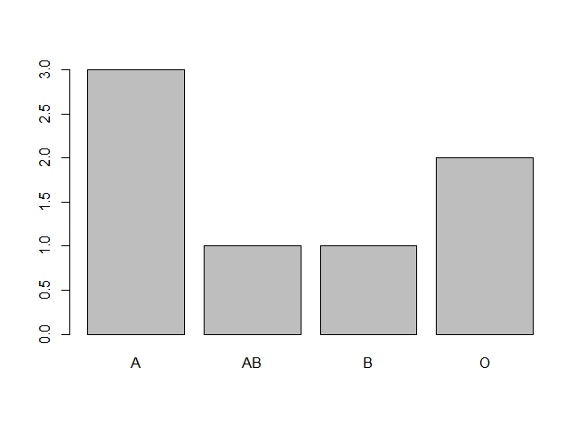

# 03.Datatype 2


## 행렬(Matrix)

- 단일형이며 행과 열로 구성된 2차원 데이터.

### 행렬 생성하기

- **matrix( 변수명,  nrow = 행개수,  ncol = 열개수  ,dimnames = NULL)**

  - dimnames로 행 이름과 열 이름을 부여할 수 있다.
  - ex ) dimnames = list(c("r1","r2"),c("c1","c2"))  *단, list형태로 줘야함!
  - 행의 이름과 열의 이름을 이용해서 인덱싱 가능!

  ```R
  x <- c(1,2,3,4)
  matrix(x, nrow =2, ncol =2 ) #변수 x를 2*2행렬로 구성
  # 실행결과
       [,1] [,2]
  [1,]    1    3
  [2,]    2    4
  
  class(matrix(x, nrow =2, ncol =2 )) # datatype 알아보기 위해 class함수 사용
  # 실행결과
  [1] "matrix" "array" 
  
  y <- matrix(c(1:4)) #nrow,ncol 생략한 경우 열을 기준으로 데이터가 생성됨.
  y
  # 실행결과  
       [,1]
  [1,]    1
  [2,]    2
  [3,]    3
  [4,]    4
  
  y <- matrix(c(1:4),nrow =2, byrow =T) #byrow =T를 쓰면 행을 기준으로 데이터가 생성됨.
  y
  # 실행결과
       [,1] [,2]
  [1,]    1    2
  [2,]    3    4
  
  
  # rbind()함수로 matrix 만들기 -> 행을 기준으로 만든다.
  x <- rbind(c(1,2,3),c(4,5,6))
  x
  # 실행결과
       [,1] [,2] [,3]
  [1,]    1    2    3
  [2,]    4    5    6
  
  # cbind()함수로 matrix 만들기 -> 열을 기준으로 만든다.
  x <- cbind(c(1,2,3),c(4,5,6))
  x
  # 실행결과
       [,1] [,2]
  [1,]    1    4
  [2,]    2    5
  [3,]    3    6
  ```

- <span style="color:blue">**t()**</span> , <span style="color:blue">**row()**</span>, <span style="color:blue">**col()**</span> 함수

  - t() 	 : 행과 열을 전환해주는 함수
  - row() : row의 index번호를 알려주는 함수
  -  col()  : column의 index번호를 알려주는 함수

  

- 데이터 접근 방법

  - **변수 이름[행 인덱스, 열 인덱스]**   -> matrix형으로 리턴

    - 행 인덱스와 열 인덱스를 비워놓는다는 건 전체행과 전체열을 의미

    ```R
    var01 <- matrix(c(1:9),3,3)
    var01
    # 실행 결과
         [,1] [,2] [,3]
    [1,]    1    4    7
    [2,]    2    5    8
    [3,]    3    6    9
    
    var01[c(1:2),2] #1,2행에 대한 2열의 성분만 출력
    # 실행 결과
    [1] 4 5
    #하나 이상일때는 c()로 자료구조의 형태로 써줘야함!
    
    #1행은 표시X, 1열과 3열에 대한 정보만 추출
    var01[-1,c(1,3)] #-로 해당 인덱스번호의 열이나 행을 제외가능
    
    #특정행만 가져오는건 특정행을 제외하는 것도 가능하다는 의미!
    var01[-c(1:2),]
    [1] 3 6 9
    
    #boolean값으로도 가능
    class(var01[-1,c(T,F,T)])
    
    # integer로 나오는 return값을 matrix로 return받고 싶다면?
    class(var05[, -c(1,3)])
    # 실행결과
    [1] "integer"
    
    class(var05[,2,drop=F]) #인덱싱 할때, drop = F 명시!
    # 실행결과
    [1] "matrix" "array" 
    
    #dimnames로 준 행이름과, 열이름으로도 인덱싱 가능!
    ```

  

- 행렬에 대한 연산이 가능하다

  - ex) 곱하기( ***** ) , 나누기 ( **/** ), 더하기( **+** ), 빼기 ( **-** )

  ``` R
  x<- matrix((1:9), nrow = 3, ncol = 3)
  x
  # 실행 결과
       [,1] [,2] [,3]
  [1,]    1    4    7
  [2,]    2    5    8
  [3,]    3    6    9
  
  x * 2 # x이 각 요소에 2를 곱하기
  # 실행 결과 
       [,1] [,2] [,3]
  [1,]    2    8   14
  [2,]    4   10   16
  [3,]    6   12   18
  
  # 행렬과 행렬을 곱하기도 가능
  y <- matrix((1:9), nrow = 3, ncol = 3)
  x*y
  # 실행 결과
       [,1] [,2] [,3]
  [1,]    1   16   49
  [2,]    4   25   64
  [3,]    9   36   81
  
  # 행렬곱도 가능
  x %*% y
  # 실행 결과
       [,1] [,2] [,3]
  [1,]   30   66  102
  [2,]   36   81  126
  [3,]   42   96  150
  # 행렬곱할때, 앞행렬의 열의개수와 뒷행렬의 행의 개수가 같아야 함
  ```

- <span style="color:blue">**apply()**</span>함수 :vector 또는 matrix를 데이터로 받아서 임의의 함수를 적용한 결과를 얻는 함수

- 함수를 인자로 받아서 함수를 실행시켜주는 역할

  - **apply( data,  방향,  함수 )**

    - 방향:  **1** → 행,  **2** → 열
    - 함수:  함수이름만 작성 ex) sum , mean

    ```R
    mat01 = matrix(c(1,2,3,4,5,6,7,8,9), nrow = 3)
    mat02 = matrix(c(1,2,3,4,5,6,7,8,9), ncol = 3)
    
    apply(mat01, 1, sum) #행의 합
    # 실행 결과
    [1] 12 15 18
    
    apply(mat01, 2, sum) #열의 합
    # 실행 결과
    [1]  6 15 24   #vector로 나옴
    
    apply(mat01, 2, max) #열의 최대값
    # 실행 결과
    [1] 3 6 9
    ```

- <span style="color:blue">**rowSums()**</span>, <span style="color:blue">**colSums()**</span>, <span style="color:blue">**rowMeans()**</span>, <span style="color:blue">**colMeans()**</span> 함수 

  - 이 함수들 사용시 apply 안써도 가능!

    

- <span style="color:blue">**order()**</span> :정렬해주는 함수

  ```R
  order(iris[,1], decreasing = T)  # iris 데이터의 첫번째 열을 기준으로 내림차순 정렬한 순서를 index로 반환
  iris[order(iris[,1], decreasing = T),] #반환된 인덱스를 다시 행인덱스로 넣어준것 
  #→ 내림차순 정렬된 순서에 맞게 iris data가 재정렬 된상태
  
  #모든 데이터는 벡터를 이용해서 만든다
  ```

  

## 배열(Array) 

- 행렬을 n차원으로 확대한 구조로 단일형 데이터이다.

### 배열 생성하기

- **array( 변수명 , dim = c( 행 수, 열 수, 차원 수 ))**

- 2차원 배열은 matrix와 구별하기 어려워서 matrix array라고 나오지만, 3차원 배열부터는 array라고 나온다!

  ```R
  arr2 <- array(1:12, dim = c(3,4))	2차원 배열
  # 실행 결과
       [,1] [,2] [,3] [,4]
  [1,]    1    4    7   10
  [2,]    2    5    8   11
  [3,]    3    6    9   12
  
  class(arr2)
  # 실행 결과
  [1] "matrix" "array"		
  
  arr3 <- array(1:12,dim = c(2,2,3)) #C(2,2,3)에서 마지막 자리가 차원을 의미
                                 	  #3이라서 3차원배열
  arr3
  # 실행 결과
  , , 1
  
       [,1] [,2]
  [1,]    1    3
  [2,]    2    4
  
  , , 2
  
       [,1] [,2]
  [1,]    5    7
  [2,]    6    8
  
  , , 3
  
       [,1] [,2]
  [1,]    9   11
  [2,]   10   12
  
  class(arr3)
  # 실행 결과
  [1] "array"
  ```


- 데이터 접근 방법

  - 3차원배열 이름 [행번호, 열번호, 차원번호] 으로 값에 접근이 가능하다.

    ``` R
    arr3[1,1,2]
    # 실행 결과
    [1] 5
    
    arr3[1,1,] # 만약 차원의 요소를 주지 않으면 각차원값들 모두 나옴.
    # 실행 결과
    [1] 1 5 9
    ```

  - apply와 같은 연산 가능!

    ```R
    apply(arr3,2,mean)	#열의 값의 평균 
    # 실행 결과
    [1] 5.5 7.5
    apply(arr3,c(1,2),mean)	#행과 열의 값의 평균
    # 실행 결과
         [,1] [,2]
    [1,]    5    7
    [2,]    6    8
    ```

  - **dim()** 함수 : data의 정보를 반환해주는 함수

    ```R
    class(iris3) # 3차원 배열
    # 실행 결과
    [1] "array"
    
    dim(iris3)  
    [1] 50  4  3
    ##-->50은 행의 개수 4는 열의 개수 3은 차원의 개수
    ```

    

## 리스트(list)

- 1차원이며 다중형 데이터이다.

- 숫자형과 문자형 등 여러가지 데이터형을 동시에 포함할 수 있는 데이터 세트.

-  key = value로 담는 자료형.

  

  ## 리스트 생성하기

  ```R
  exList <- list(name = "조수연" , age = 25)	# 리스트 생성
  # 실행 결과   #$뒤에 key값이 나오는 것 확인할 수 있다.
  $name
  [1] "조수연"
  
  $age
  [1] 25
  
  str(exList) #리스트의 구조
  # 실행 결과 
  List of 2
   $ name: chr "조수연"   # 문자형 데이터와 숫자형 데이터 2가지로 데이터형으로 구성된 리스트
   $ age : num 25
  
  #key값이 없는 경우.
  exList1 <- list(1:4,rep(3:5,2),"dog")
  exList1
  # 실행 결과    #key값이 없어 [[1]]과 같이 번호로 대체된 것 확인할 수 있다.
  [[1]]
  [1] 1 2 3 4
  
  [[2]]
  [1] 3 4 5 3 4 5
  
  [[3]]
  [1] "dog"
  
  str(exList1)
  # 실행 결과 
  List of 3
   $ : int [1:4] 1 2 3 4
   $ : int [1:6] 3 4 5 3 4 5
   $ : chr "dog"
  
  # 리스트가 리스트 중첩도 가능!
  overList <- list(a=list(c(1,2,3)),
                   b=list(c(1,2,3,4)))
  # 실행 결과 
  $a
  $a[[1]]
  [1] 1 2 3
  
  
  $b
  $b[[1]]
  [1] 1 2 3 4
  
  str(overList)
  # 실행 결과
  List of 2
   $ a:List of 1          
    ..$ : num [1:3] 1 2 3   #중첩되어 있고 키값이 없는 형태
   $ b:List of 1
    ..$ : num [1:4] 1 2 3 4
  
  ```


- 데이터 접근 방법

  - 여러 개의 벡터들이 컬럼이 되는 것!
    - 타입이 다른 벡터들이 하나의 리스트가 되어 만들어질 수 있다.
  - list의 요소를 가져올때는 key 값으로 접근해서 인덱싱해야 함.
    - key로 접근하면 벡터가 되서 그때부터 인덱싱이 가능하다.

  ```R
  # key를 활용한 정보는 $ 기호로 연결
  
  overList <- list(a=list(c(1,2,3)),
                   b=list(c(1,2,3,4)))
  
  # 내부의 리스트에 키값이 없을 경우,
  overList$a[[1]] #이런식으로 접근 가능
  # 실행 결과
  [1] 1 2 3
  
  overList2 <- list(a=list(e=c(1,2,3)),
                   b=list(f=c(1,2,3,4))) 
  overList2
  # 실행 결과
  $a        
  $a$e		
  [1] 1 2 3
  
  
  $b
  $b$f
  [1] 1 2 3 4
  
  str(overList2)
  List of 2
   $ a:List of 1
    ..$ e: num [1:3] 1 2 3  # 중첩되어있고 키값이 있는 상태
   $ b:List of 1
    ..$ f: num [1:4] 1 2 3 4
  
  # 내부의 리스트에 키값이 있을 경우엔 $와 키값을 활용해 접근가능!
  overList2$a$e
  # 실행 결과
  [1] 1 2 3
  
  
  userInfo <- list(name = 'suyeon',
                   address ='경기도',
                   tel     ='010-1111-1111',
                   age     = 25,
                   marraige= F)
  userInfo[1] 
  # 실행 결과
  $name
  [1] "suyeon"  # list형으로 반환 (서브리스트) 
  
  userInfo[[c(1,1)]] # 다시 인덱스로 접근해야 value값으로 받을 수 있음!
  # 실행 결과 
  [1] "jslim"  #vector형으로 반환
  
  userInfo$name
  # 실행 결과
  [1] "suyeon" #vector형으로 반환
  
  ```

  - 값 변경하고 싶을때 - 해당 값 인덱싱하고 assign해주면 됨

    ```R
    userInfo$age[1] <- 30 # 25->30 으로 변경
    userInfo$age
    # 실행 결과     
    [1] 30
    ```

  - 새로운 키, 값을 추가 - **list_name $ key_name  <-  c( key값 , vluae값 )**

    ```R
    userInfo$id <- "syeon"
    str(userInfo)
    # 실행 결과
    List of 6
     $ name    : chr "suyeon"
     $ address : chr "경기도"
     $ tel     : chr "010-1111-1111"
     $ age     : num 30
     $ marraige: logi FALSE
     $ id      : chr  "syeon"
    ```

  - key 제거
  
    ```R
    userInfo$id <- NULL  #제거할 키에 NULL값 assign해주기
    str(userInfo)
    # 실행 결과
    List of 6
     $ name    : chr "suyeon"
     $ address : chr "경기도"
     $ tel     : chr "010-1111-1111"
     $ age     : num 30
     $ marraige: logi FALSE
    ```
  
  - value값의 데이터가  벡터형이어야 하는 것은 X!
  
    ```R
    lst01 <- list(one = c("one","two","three"),
                  two = matrix(1:9,nrow =3),
                  three = array(1:12, dim=c(2,3,2)))
    
    str(lst01)
    # 실행 결과
    List of 3
     $ one  : chr [1:3] "one" "two" "three"
     $ two  : int [1:3, 1:3] 1 2 3 4 5 6 7 8 9
     $ three: int [1:2, 1:3, 1:2] 1 2 3 4 5 6 7 8 9 10 ...
    ```
  
    
  
  - **lapply(), sapply()** 함수
  
    - 리스트를 반환해주는데 return 값에 차이가 있음 → 자료구조의 차이가 있을 수 있음
  
    - lapply(데이터, 함수): return 값이 list, key = value →key값과 value값 같이 반환
  
    - sapply(데이터, 함수):return 값이  value (vector) 
  
    - #해당함수가 없는 경우 사용자 정의 함수로도 대체 가능
  
      ```R
      lst04 <- list(1:5)
      lst05 <- list(6:10) 
      
      lapply(X = c(lst04,lst05),FUN = sum)
      # 실행 결과 
      [[1]]      # 리스트로 반환
      [1] 15
      
      [[2]]
      [1] 40
      
      sapply(X = c(lst04,lst05),FUN = sum)
      # 실행 결과  
      [1] 15 40    # 벡터로 반환
      
      result <- lapply(1:3,function(x){x*2}) # 각 요소에 2씩 곱해주는 사용자 정의 함수.
      class(result)
      # 실행 결과
      [[1]]
      [1] 2
      
      [[2]]
      [1] 4
      
      [[3]]
      [1] 6
      
      class(unlist(result)) #요소에 더 쉽게 접근하기 위해 unlist 사용해서 벡터값으로 바꿔줌
      #리턴값 
      [1] "list"  # 벡터를 넣었지만, 리스트로 리턴됨(lapply함수는 return값이 list이기 때문에!)
      result2 <- sapply(1:3,function(x){x*2})
      class(result2) 
      #리턴값 > [1] "numeric" 벡터로 리턴
      ```
  
      

## 데이터 프레임(Data Frame)

- 실제 업무에서 가장 많이 사용하는 데이터 세트
- 숫자형 벡터, 무자형 벡터 등 서로 다른 형태의 데이터를 묶을 수 있는 다중형 데이터 세트.
- **data.frame( 변수명 1 , 변수명 2 , ... , 변수명 n)**
- Data Frame VS DB의 table
  - 공통점 : 구조는 비슷하다.
  - 차이점  
    - 데이터 저장 방식
      - DF - 칼럼단위기준으로  데이터 저장
      - DB - 행단위 기준으로 데이터 저장, 
    - 데이터가 크다?
      - DF -열이 많아야 데이터가 큰 것
      - DB - 행과 열이 많아야 데이터가 큰 것
    - DF 관점에서 행이 많다는 것은 logic처리 시간이 길다는 의미이고, 열이 많다는 것은 분석해야 할것이 많다는 뜻 → DF는 열이 더 중요하다!

## 데이터 프레임 생성하기

```R
sampleDF <- data.frame(x=c(1,2,3,4,5),
                       y=c(2,4,6,8,10))
# 실행 결과 
  x  y
1 1  2
2 2  4
3 3  6
4 4  8
5 5 10

sampleDF$x
# 실행 결과 
[1] 1 2 3 4 5   # 벡터로 리턴됨 -> 인덱싱 가능!

sampleDF[1,]    #인덱싱 가능
# 실행 결과 
 x y
1 1 2

sampleDF[-1,c("x","y")] # 칼럼 이름으로도 접근 가능
#하나의 컬럼 선택시,리턴값 형식은 vector
#하나 이상의 컬럼을 선택시, 리턴값 형식은 DF

# vector로 리턴받는 것을 data.frame 형식으로 반환받기를 원한다면?
sampleDF[-1,"x",drop =F]  #drop = F 를 옵션으로 줘야함
```

- **rownames(), colnames()** - 행과 열의 이름이 없을 때 이름 만들어 주는 것

- **names()** - column 이름 가져오는 함수

  ```R
  sampleDF <- data.frame(1:3,4:6)
  sampleDF
  # 실행 결과      
    X1.3 X4.6   # 이름 지정 안해줘서 랜덤으로 부여된 것.
  1    1    4
  2    2    5
  3    3    6
  colnames(sampleDF) <- c("feature01","feature02")  #열이름 지정.
  rownames(sampleDF) <- c("idx01","idx02","idx03")  #행이름 지정.
  sampleDF
  # 실행 결과 
        feature01 feature02   # 이름들이 지정한대로 적용된 상태 
  idx01         1         4
  idx02         2         5
  idx03         3         6
  
  names(sampleDF) # 열이름들 출력.
  # 실행 결과 
  [1] "feature01" "feature02"
  ```

- **nrow() , ncol()**  함수

  - nrow(DF) : 데이터프레임의 행 개수 반환
  - ncol(DF)  : 데이터프레임의 열 개수 반환

- **rbind(), cbind()** 함수
  
  - rbind(DF , 추가할 행에 들어갈 데이터) : 데이터 프레임에 새로운 행을 추가해줌
  - cbind(DF , 추가할 열에 들어갈 데이터) : 데이터 프레임에 새로운 열을 추가해줌


### 범주형(factor)

- 범주형Categorical 데이터(자료)를 표현하기 위한 데이터 형

- 범주형 데이터란 데이터가 사전에 정해진 특정 유형으로만 분류되는 경우를 뜻함 → 범주형으로 관리하면 분석이 수월해진다.

- **factor(x,levels,ordered)** / **as.factor()**

  - x : 팩터로 표현하고자 하는 값(주로 문자열 벡터로 지정)
  - levels : 값의 레벨 (범주형 변수가 담을 수 있는 값의 목록)
  - ordered : True 이면 순서형 - 순서를 둘 수 있는 경우  , False(기본값)이면 명목형 - 값들의 크기비교가 불가능한 경우로 level에 지정한 순서대로 값의 크기가 정해집니다.

  ```R
  tmp.factor <- c('A','O','AB','B','A','O','A')
  tmp.factor
  # 실행 결과
  [1] "A"  "O"  "AB" "B"  "A"  "O"  "A" 
  #vector-> factor로 변환
  blood.factor <- factor(tmp.factor) # factor() 함수로 factor 만들어줌. 
  blood.factor
  # 실행 결과
  [1] A  O  AB B  A  O  A 
  Levels: A AB B O  
  
  nlevels(blood.factor) # level의 개수 구하는 함수
  # 실행 결과
  [1] 4
  levels(blood.factor)  # factor에서 level의 목록을 반환한다.
  # 실행 결과
  [1] "A"  "AB" "B"  "O"
  is.factor(blood.factor)  # factor인지 아닌지 판별해주는 함수
  # 실행 결과
  [1] TRUE  #factor이면 T 아니면 F
  ordered(blood.factor) # 순서형 팩터를 생성한다.
  [1] A  O  AB B  A  O  A 
  Levels: A < AB < B < O    # 순서를 나타내준 것
  
  #빈도수 구할 때 사용하는 함수 (범주형일때 가능! 그냥 문자열일때는 빈도 계산 불가능)
  table(blood.factor)
  # 실행 결과
  #blood.factor
  #A AB  B  O 
  #3  1  1  2 
  plot(blood.factor) #시각화시켜줌
  
  ```

  

- **with()** 함수 : 읽기전용, 식을 만들어서 결과를 확인하기 위해 주로 사용

  - **with (dataset, 함수()|표현식)**  
  - tapply 사용시 ,  **with(dataset, tapply(vector,factor, func))**

- **within()** 함수 : 필드의 값을 수정할때 주로 사용

- 데이터프레임 또는 리스트내에 존재하는 속성(칼럼, 필드)을 손쉽게 접근하기 위한 함수

  ```R
  #iris의 sepal.length와 sepal.width의 각각의 평균값을 구하고 싶을때
  with(iris,{print(mean(Sepal.Length))
             print(mean(Sepal.Width))})
  
  # 실행 결과
  [1] 5.843333
  [1] 3.057333
  
  #NA 값 있으면 평균,중위수 못구함 -> NA 값 없애주고 계산해야 함!
  #na값 없애주고 계산해야함	-> na.rm = T 포함시켜서 작성!
  x <- data.frame(val = c(1,2,3,4,NA,5,NA))
  x
  # 실행 결과
    val
  1   1
  2   2
  3   3
  4   4
  5  NA
  6   5
  7  NA
  
  mean(x$val, na.rm =T)
  # 실행 결과
  [1] 3
  median(x$val, na.rm =T)
  # 실행 결과
  [1] 3
  ```

- **tapply ()** 함수 : group by 역할

  - **tapply(vector(r객체는 사실 다가능 - 단, 범주형값이어야함 ), index, func)**
  - 그룹의 속성이 당연히 **facter**로 지정되어 있어야 함.
  - **with(dataset, tapply())** - dataframe형일 경우, with함수와 사용하면  tapply함수내에서 칼럼에 대한 조건이 더 용이하다! → df_name$col_name  이런식이 아니라 col_name만 명시해줘도 OK 

  ```R
  # 그룹내에 벡터의 합을 구할 때 (같은 그룹의 경우.) 
  tapply(1:10,rep(1,10),sum) #1이라는 index를 10번 반복한 것. -> index번호가 1로 다 같아서 다 같은 그룹에 속한다.
  # 실행 결과
   1 
  55 
  # 그룹내에 벡터의 합을 구할 때 (다른 그룹의 경우.)
  tapply(1:10,1:10,sum) #1번 그룹엔 1, 2번 그룹엔 2,... 이런식으로 값이 들어가 있어서 그룹내 합을 구하면 아래와 같은 값이 반환된다.
  # 실행 결과
   1  2  3  4  5  6  7  8  9 10 
   1  2  3  4  5  6  7  8  9 10 
  
  #1~10까지 숫자를 홀수 짝수별로 묶어서 합계
  x <- 1:10
  tapply(x,ifelse(x%%2 ==1, 1,2), sum)
  # 실행 결과
   1  2      #1이 홀수인 경우, 2가 짝수인 경우
  25 30 
  ```

  


  #1 index 그룹 안에 합을 구한 것. -> 55라는 리턴값
  tapply(1:10,1:10,sum)  #1부터 10까지 index에 1부터 10까지 그룹이 묶임
  #1~10까지 숫자를 홀수 짝수별로 묶어서 합계
  x <- 1:10
  tapply(x,ifelse(x%%2 ==1, 1,2), sum)

  tapply(x,1:10 %% 2 == 0 ,sum)

- **ifesle ()** 함수 

  -  **ifelse( 조건 , 참일때 값 , 거짓일때 값 )**  
  - sql 에서 decode, case구문과 같은 역할

- **is.na(val)** 함수 : val에 NA값이 있으면 TRUE 반환해주는 함수.

  ```R
  x <- data.frame(val = c(1,2,3,4,NA,5,NA))
  # NA값을 평균값으로 대체해줄때
  # 방법 1. ifelse 활용해서 만약, val가 NA라면 NA값을 제거한 평균 값을 넣고, NA가 아니라면 val값을 그대로 넣어주는 방법
  x <- within(x,
              val<-ifelse(is.na(val),mean(x$val,na.rm = T),val)) 
  
  # 방법 2. boolean값을 인덱싱으로 줘서 TRUE일때만 해당 내용 assign 시키는 방법
  x$val[is.na(x$val)] <- median(x$val,na.rm = T)  
  
  ```

- **t(matrix|dataframe)** : 행과 열을 전환시켜주는 함수

  ```R
  x<- data.frame(x= 1:4, y =1:4)
  x
  # 실행 결과
    x y
  1 1 1
  2 2 2
  3 3 3
  4 4 4
  
  x2 <- t(x)  #행과 열 전환 해줌
  x2
  # 실행 결과
    [,1] [,2] [,3] [,4]
  x    1    2    3    4
  y    1    2    3    4
  ```

   

- **split (x,f) -**  기준이 되는 컬럼 또는 factor에 따라 데이터를 분리하는 함수 

  - **split( 분리할 데이터, 기준이 되는 칼럼 | factor)**

    ```R
    split(iris$Sepal.Length,iris$Species) # iris의 sepal.length칼럼을 species를 기준으로 나눠준것
    # 실행 결과 
    $setosa
     [1] 5.1 4.9 4.7 4.6 5.0 5.4 4.6 5.0 4.4 4.9 5.4 4.8 4.8 4.3 5.8 5.7 5.4 5.1 5.7 5.1 5.4
    [22] 5.1 4.6 5.1 4.8 5.0 5.0 5.2 5.2 4.7 4.8 5.4 5.2 5.5 4.9 5.0 5.5 4.9 4.4 5.1 5.0 4.5
    [43] 4.4 5.0 5.1 4.8 5.1 4.6 5.3 5.0
    
    $versicolor
     [1] 7.0 6.4 6.9 5.5 6.5 5.7 6.3 4.9 6.6 5.2 5.0 5.9 6.0 6.1 5.6 6.7 5.6 5.8 6.2 5.6 5.9
    [22] 6.1 6.3 6.1 6.4 6.6 6.8 6.7 6.0 5.7 5.5 5.5 5.8 6.0 5.4 6.0 6.7 6.3 5.6 5.5 5.5 6.1
    [43] 5.8 5.0 5.6 5.7 5.7 6.2 5.1 5.7
    
    $virginica
     [1] 6.3 5.8 7.1 6.3 6.5 7.6 4.9 7.3 6.7 7.2 6.5 6.4 6.8 5.7 5.8 6.4 6.5 7.7 7.7 6.0 6.9
    [22] 5.6 7.7 6.3 6.7 7.2 6.2 6.1 6.4 7.2 7.4 7.9 6.4 6.3 6.1 7.7 6.3 6.4 6.0 6.9 6.7 6.9
    [43] 5.8 6.8 6.7 6.7 6.3 6.5 6.2 5.9
     
    class(split(iris$Sepal.Length,iris$Species)) 
    # 실행 결과
    [1] "list"
    ```

    

- **subset() 함수** : DF로 부터 조건에 만족하는 행을 추출하여 그걸 data.frame으로 만들어 주는 함수.

  - **subset(dataset, 조건, select = c(가져올 칼럼들))**

  - 행에 대한 제한

    ```R
    x<-1:5
    y<-6:10
    z <- letters[1:5]
    tmp.frm <- data.frame(x,y,z) #데이터 프레임 생성
    tmp.frm
    # 실행 결과
      x  y z
    1 1  6 a
    2 2  7 b
    3 3  8 c
    4 4  9 d
    5 5 10 e
    
    tmp.frm.subset <- subset(tmp.frm, x>=3) # x가 3이상인 값들만 dataframe으로 생성.
    tmp.frm.subset
    # 실행 결과
      x  y z
    3 3  8 c
    4 4  9 d
    5 5 10 e
    
    tmp.frm.subset <- subset(tmp.frm, x>=2 & y <=8) # 조건이 2개인 경우 연산자 활용해서 연결!
    tmp.frm.subset
    # 실행 결과
      x y z
    2 2 7 b
    3 3 8 c
    
    #1,3,5번 컬럼(=>Sepal.Length, Petal.Length, Species)을 대상으로 subset 
    # #petal.length가 petal.length의 평균보다 큰 것들만.
    tmp.iris.subset <- subset(iris, 
                              Petal.Length>=mean(Petal.Length), 
                              select = c(Sepal.Length,Petal.Length,Species))
    tmp.iris.subset
        Sepal.Length Petal.Length    Species
    51           7.0          4.7 versicolor
    52           6.4          4.5 versicolor
    53           6.9          4.9 versicolor
    54           5.5          4.0 versicolor
    55           6.5          4.6 versicolor
    56           5.7          4.5 versicolor
    57           6.3          4.7 versicolor
    59           6.6          4.6 versicolor
    60           5.2          3.9 versicolor
    62           5.9          4.2 versicolor
    63           6.0          4.0 versicolor
    64           6.1          4.7 versicolor
    66           6.7          4.4 versicolor
    67           5.6          4.5 versicolor
    68           5.8          4.1 versicolor
    69           6.2          4.5 versicolor
    70           5.6          3.9 versicolor
    71           5.9          4.8 versicolor
    72           6.1          4.0 versicolor
    73           6.3          4.9 versicolor
    74           6.1          4.7 versicolor
    75           6.4          4.3 versicolor
    76           6.6          4.4 versicolor
    77           6.8          4.8 versicolor
    78           6.7          5.0 versicolor
    79           6.0          4.5 versicolor
    81           5.5          3.8 versicolor
    83           5.8          3.9 versicolor
    84           6.0          5.1 versicolor
    85           5.4          4.5 versicolor
    86           6.0          4.5 versicolor
    87           6.7          4.7 versicolor
    88           6.3          4.4 versicolor
    89           5.6          4.1 versicolor
    90           5.5          4.0 versicolor
    91           5.5          4.4 versicolor
    92           6.1          4.6 versicolor
    93           5.8          4.0 versicolor
    95           5.6          4.2 versicolor
    96           5.7          4.2 versicolor
    97           5.7          4.2 versicolor
    98           6.2          4.3 versicolor
    100          5.7          4.1 versicolor
    101          6.3          6.0  virginica
    102          5.8          5.1  virginica
    103          7.1          5.9  virginica
    104          6.3          5.6  virginica
    105          6.5          5.8  virginica
    106          7.6          6.6  virginica
    107          4.9          4.5  virginica
    108          7.3          6.3  virginica
    109          6.7          5.8  virginica
    110          7.2          6.1  virginica
    111          6.5          5.1  virginica
    112          6.4          5.3  virginica
    113          6.8          5.5  virginica
    114          5.7          5.0  virginica
    115          5.8          5.1  virginica
    116          6.4          5.3  virginica
    117          6.5          5.5  virginica
    118          7.7          6.7  virginica
    119          7.7          6.9  virginica
    120          6.0          5.0  virginica
    121          6.9          5.7  virginica
    122          5.6          4.9  virginica
    123          7.7          6.7  virginica
    124          6.3          4.9  virginica
    125          6.7          5.7  virginica
    126          7.2          6.0  virginica
    127          6.2          4.8  virginica
    128          6.1          4.9  virginica
    129          6.4          5.6  virginica
    130          7.2          5.8  virginica
    131          7.4          6.1  virginica
    132          7.9          6.4  virginica
    133          6.4          5.6  virginica
    134          6.3          5.1  virginica
    135          6.1          5.6  virginica
    136          7.7          6.1  virginica
    137          6.3          5.6  virginica
    138          6.4          5.5  virginica
    139          6.0          4.8  virginica
    140          6.9          5.4  virginica
    141          6.7          5.6  virginica
    142          6.9          5.1  virginica
    143          5.8          5.1  virginica
    144          6.8          5.9  virginica
    145          6.7          5.7  virginica
    146          6.7          5.2  virginica
    147          6.3          5.0  virginica
    148          6.5          5.2  virginica
    149          6.2          5.4  virginica
    150          5.9          5.1  virginica
    ```

- 


## 형변환 함수

자료구조를 변환하는 건 어떤 데이터형태가 들어있느냐에 따라 적절한 데이터로 변경된다.

- as. 또는 해당 데이터 형의 이름으로 감싸면 OK

- as. : 형 변환함수 - **as.바꿀데이터형**
  - as.character(x) : 문자형으로 바꿔준다.
  - as.numeric(x) : 숫자형으로 바꿔준다.
  - as.vector(x) : 벡터로 바꿔준다.
  - as.matrix(x) : 행렬로 바꿔준다.
  - as.list(x) : 리스트로 바꿔준다.
  - as.data.frame(x) : 데이터프레임으로 바꿔준다.
  - as.factor(x) : 팩터로 바꿔준다.
- **unlist(list)** : 리스트 → 벡터로 형 변환해주는 함수

