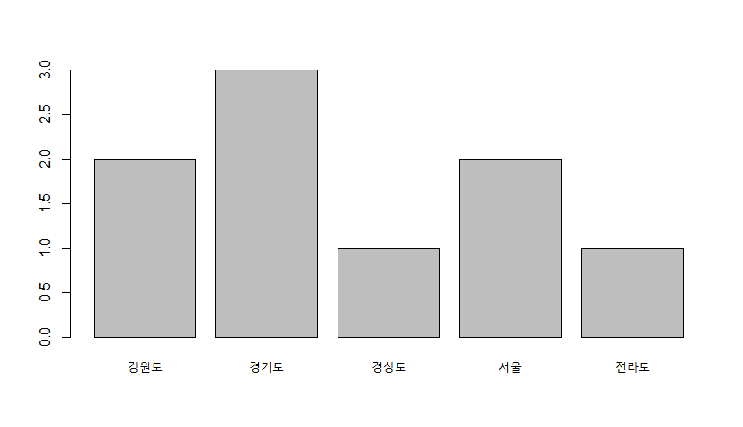
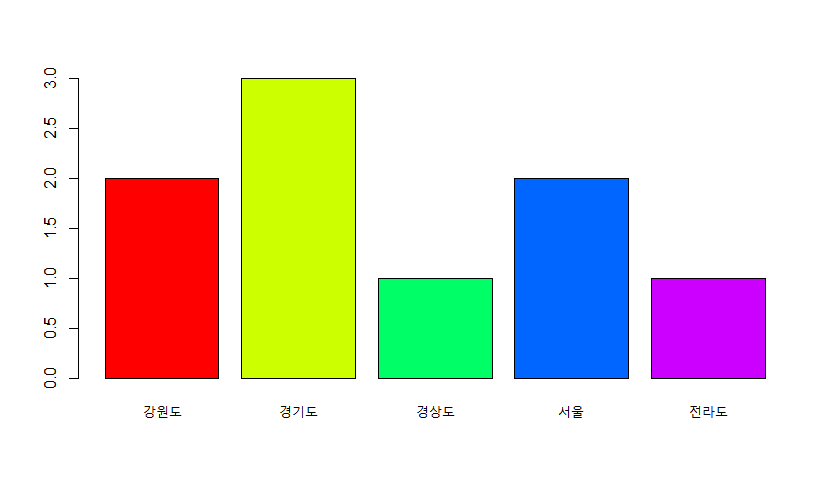
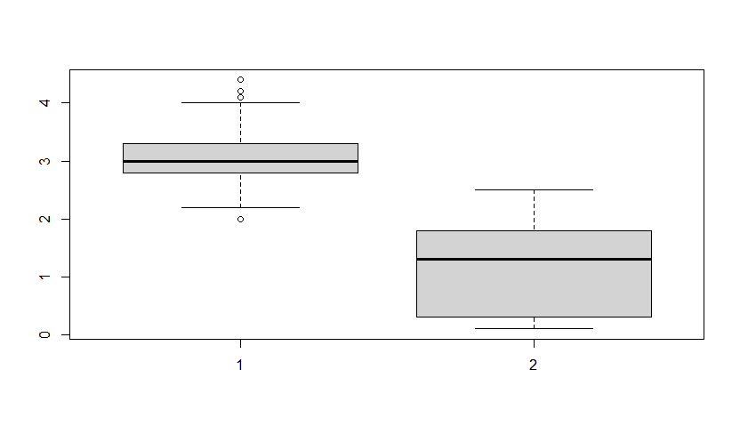

# 06. 데이터 가공 2


## 데이터분석을 위한 기초 통계 분석 함수

| 기술 통계 함수 | 기능           | 설명                                                         |
| -------------- | -------------- | ------------------------------------------------------------ |
| mean()         | 평균           | 데이터를 모두 더한 후 개수로 나눈 값                         |
| median()       | 중앙값(중위수) | 데이터를 크기순으로 정렬했을 때 가운데 있는 값 (데이터 개수가 짝수면 가운데 있는 두개의 값을 더해 2로 나눈 값) |
| max()          | 최댓값         | 데이터를 순서대로 정렬했을 때 가장 큰 값                     |
| min()          | 최솟값         | 데이터를 순서대로 정렬 했을 때 가장 작은 값                  |
| range()        | 범위           | 최댓값에서 최솟값의 범위                                     |
| quantile()     | 분위수         | 데이터를 순서대로 정렬했을 때 하위 25%, 50%, 75% 지점의 값 probs 옵션에 따라 1사분위수 (Q1), 2사분위수(Q2), 3사분위수(Q3)로 구분 |
| var()          | 분산           | 데이터가 평균으로부터 퍼진 정도를 설명하는 통계량 ( 분산값이 작을수록 평균에 몰려있음 ) |
| sd()           | 표준편차       | 데이터 값이 퍼진 정도를 설명하는 통계량 (표준편차 값이 클수록 넓게 퍼짐 ) |
| kurtosi()      | 첨도(Kurtosis) | 데이터 분포가 뾰족한 정도를 설명하는 통계량 (통계량이 0보다 크면 정규분포 대비 뾰족하며, 0보다 작으면 정규분포 대비 평평함) |
| skew()         | 왜도(Skewness) | 데이터 분포의 비대칭성을 설명하는 통계량 (통계량의 절대값이 클수록 비대칭이 심하고, +값이면 오른쪽으로 꼬리가 길고, -값이면 왼쪽으로 꼬리가 긴 형태) |
| n()            | 개수           | 관측치 개수                                                  |


- **summary() , describe() 함수** 

  ```R
  # describe() 함수를 사용하기 위해선 psych 패키지 설치와 로드가 필요함!
  install.packages("psych") # psych 패키지 설치
  library(psych) # psych 패키지 로드
  
  x<-c(1,2,3,4,5,100)
  
  summary(x)
  # 실행 결과
     Min. 1st Qu.  Median    Mean 3rd Qu.    Max. 
     1.00    2.25    3.50   19.17    4.75  100.00
  
  describe(x)
  # 실행 결과
     vars n  mean    sd median trimmed  mad min max range skew kurtosis    se
  X1    1 6 19.17 39.63    3.5   19.17 2.22   1 100    99 1.36    -0.09 16.18
  ```

  

### 특정 값이 얼마나 반복되는지 알 수 있는 빈도 분석

- **freq() 함수** : 데이터의 항목별 빈도 및 빈도 비율을 나타내는 방법

  ```R
  y<-c("서울","서울","경기도","강원도","경상도","강원도","경기도","경기도","전라도")
  
  freq(y)
  # 실행 결과
  y 
         Frequency Percent
  강원도         2   22.22
  경기도         3   33.33
  경상도         1   11.11
  서울           2   22.22
  전라도         1   11.11
  Total          9  100.00
  ```

  

## 데이터의 이해도를 높일 수 있는 그래프

- **stem () 함수** 

  - 전체 형태를 파악하는 줄기 잎 그림
  - 변수의 값을 자릿수에 따라 분류하여 시각화하는 방법.
  - 큰 자릿수의 값은 줄기에 표현하고 작은 자릿수의 값은 잎에 표현하여 전체적인 형태를 파악할 수 있게 한다.

  ```R
  age<-c(10,13,20,22,33,35,47,48,49,54,65,77,79)
  stem(age)
  # 실행 결과
  
    The decimal point is 1 digit(s) to the right of the |
  
    0 | 03
    2 | 0235
    4 | 7894
    6 | 579
  ```

  

- **hist() 함수**

  - 도수 분포 상태를 기둥 모양으로 표현한 히스토그램
  - 연속형 데이터를 일정하게 나눈 구간(계급)을 가로축, 각 구간에 해당하는 데이터의 수(도수)를 세로축으로 그린 그래프

  

- **막대그래프**

  - 범주형 데이터에 대해 수량이 많고 적음을 나타낼때 적합한 그래프

  - **freq() 함수**

    - freq() 함수 사용시 자동으로 막대그래프가 그려진다.

  - **barplot() 함수**

    - barplot() 함수에는 빈도 분석 기능이 없으므로 table() 함수를 사용하여 특정 변수의 데이터 빈도를 데이터 세트 형태로 출력한 후 사용해야 한다

      ```R
      y<-c("서울","서울","경기도","강원도","경상도","강원도","경기도","경기도","전라도")
      # table함수를 이용해 빈도수를 구해 area 변수에 저장
      area<-table(y)
      barplot(area,
              col = rainbow(5)) # 색을 무지개 색 5가지로 배정.
      ```

      



- 히스토그램과 막대그래프의 차이

  |    항목     |        히스토그램         |          막대그래프           |
  | :---------: | :-----------------------: | :---------------------------: |
  |    함수     |          hist()           |           barplot()           |
  | 데이터 형태 |          연속형           |            이산형             |
  | 데이터 예시 |     키, 나이, 금액 등     |         성별, 지역 등         |
  | 그래프 차이 | 그래프의 막대가 붙어 있음 | 그래프의 막대가 분리되어 있음 |

  

- **boxplot() 함수**

  - 데이터의 분포를 비교하거나 데이터 분포에서 심하게 벗어난 극단의 데이터, 즉 이상치를 판단할 때 주로 사용.

  ```R
  iris # 내장 데이터 iris 로드
  boxplot(iris$Sepal.Width,iris$Petal.Width) # Sepal.Width에 이상치값 존재하는 것 확인 가능
  # 그래프에 표시되는 동그라미들이 이상치값을 의미.
  ```

  

