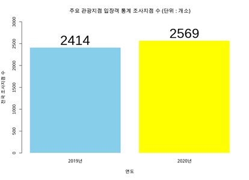
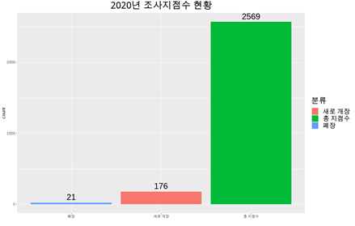

# 데이터 분석 프로젝트 

## 주제 : 코로나 19로 인한 관광,여행 산업의 변화 분석


### 목표 : 전국 주요관광지점 입장객 통계를 분석하여 코로나 19가 국내 관광지점 운영에 미친 영향 확인해보기.


#### 3. 데이터 분석

```R

# 3 - 1 조사 관광지점 수 비교

# 코로나 전후 전국 조사지점 수 변화가 있는지? (증가 ? 감소?)
str(korea_data)
korea_data_count<-korea_data %>%
  group_by(관광지명) %>%
    filter(`내/외국인` == '합계') %>%
      mutate(new_open = ifelse(is.na(인원합계_2019) & (is.na(인원합계_2020)==F),"new open","open"),
         closed = ifelse(is.na(인원합계_2019) == F & is.na(인원합계_2020), "closed","open"))


library(descr)

# stauts_table으로 새로 오픈, 폐업상태를 나타내는 dataframe 생성
status_table <-bind_rows(table(korea_data_count$new_open),table(korea_data_count$closed))
status_table<-as.data.frame(status_table)
str(status_table)

# 2019년 값과 2020년값기준으로 재배치해서 원하는 형태로 세팅.
status_table$`new open` <- c(NA, 176)
status_table_reverse <- t(status_table)
status_table_reverse <- as.data.frame(status_table_reverse)
status_table_reverse<-rename(status_table_reverse, "2019" = V1, "2020" = V2)
rownames(status_table_reverse)<-c(1,2,3)
status_table_reverse$status <- c("새로 개장","총 지점수","폐장")
status_table_reverse$status<- as.factor(status_table_reverse$status)

# 전국 관광지 조사지점 수 비교 (2019 vs 2020)
bar_korea_count<-barplot(status_table$open, 
        main ="주요 관광지점 입장객 통계 조사지점 수 (단위 : 개소)",
        names= c("2019년","2020년"),
        col =c("sky blue","yellow"),
        xlab="연도",
        ylab = "전국 조사지점 수",
        ylim = c(0,3000),
        border="white")
text(bar_korea_count, status_table$open, labels=status_table$open, pos = 3)


 

```




<그래프 1 - 주요 관광지점 입장객 통계자료의 조사지점 수를 연도별로 비교한 그래프 >

**해석 :** 코로나 전을 2019년, 코로나 후를 2020년으로 보았고, 전국의 조사지점 수의 총량은 2020년에 전년 대비 155개가 증가하였다. 


```R
library(ggplot2)

# 2020년 총 조사지점수와 새로 개장, 폐장 수 시각화 
ggplot(status_table_reverse,aes(x=status, y = `2020`,fill=status))+
  geom_bar(stat = "identity")+
  scale_x_discrete(limits = c("폐장", "새로 개장", "총 지점수"))+
  ggtitle("2020년 총 조사지점 현황")+
  geom_text(aes(y=`2020`,label=`2020`), 
            position = position_dodge(width = 1.8),
            vjust = -0.5)+
  labs(fill = "분류")+
  xlab("")+
  ylab("count")    
```




<그래프2 - 2020년 조사지점 총량을 세분화해서 표현한 그래프>

**해석:** 2020년 전국 조사지점 수는 전년대비 새로 개장한 지점이 176개, 폐장한 지점이 21개이고, 전체적으로는 155개가 증가한 것을 확인할 수 있다.

→ 통계자료의 결측값을 활용하여 알아낸 결과로 입장객 수의 통계자료이므로 결측값은 관광지점 휴장상태/개장 전 상태/폐장 후 상태 중 하나라고 해석할 수 있다. (ex.2019년엔 na값이었다가 2020년에 수치 값이 있다면, 2020년부터 운영을 시작한 것) 따라서, 유의미한 결측값으로 보고 삭제나, 다른 값으로 대체하지 않았다.

-  분류부분 해석
  - 폐장 = 2019값 결측값X & 2020년 결측값O

  - 새로 개장 = 2019 결측값O & 2020년 결측값 X
  - 총지점수 = 2020년 총 조사지점 수


#### 3 - 1 결론 

   새로 개장한 지점수가 176개로 폐장한 지점수인 21개보다 비교적 더 많기 때문에 코로나 19가 전국 조사지점 수에는 예상보다 큰 영향을 미치지 않은 것으로 추정된다. 폐장한 곳보다 오히려 새로 개장한 곳이 더 많으므로 코로나로 인해 폐장했다고 보기엔 무리가 있을 것 같다.
